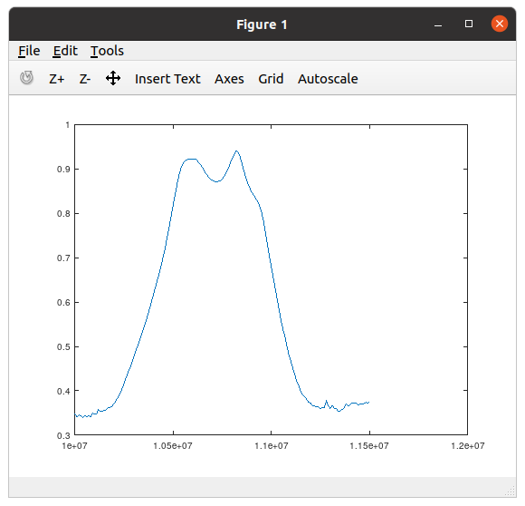

# nwt7octave
NWT7 controll via Octave


#### Before You start using this library, install ```instrument-control package``` for Octave:
in Ubuntu, type the following command from shell:

```$ sudo apt install octave-instrument-control```

Then, after You start Your session in Octave, load the above library:

```octave:1> pkg load instrument-control```

#### Example 1:
For an NWT7 connected by some USB<->RS232 converter to /dev/ttyUSB0, with a PIC16F876A driven by 10MHz cristal oscillator and an AD9851 driven by 32MHz cristall oscillator, configured by an internal jumper for high speed RS232, we want to generate 1.8 MHz sin wave and check the response with 10-bit resolution in the channel 0 (whether this is an input of a linear detector or a log detector, depends on how this particular NWT7 was assembled; it can be even another type of head in Your NWT7 - e.g. some spectrum analyzer or an antenna analyzer).

```octave:2> nwt7 = nwt7config(1, 32, 10, "/dev/ttyUSB0", true)```

```octave:3> nwt7measure(nwt7, 1800000, 0, 10)```

#### Example 2:
Assuming NWT7 and its configuration (variable ```nwt7```) as in the previous example, we want to measure a filter response to channel 0.

First, set the frequencies between 10MHz and 11.5MHz with step 10kHz:

```octave:3> freq = 10e+6:10e+3:11.5e+6;```

Next, having the filter connected between NWT7"s output and channel 0 input, sweep the frequencies measuring the response:

```octave:4> resp = nwt7freqanalyze(nwt7, freq, 0);```

Now, we could plot the reponses as a function of frequency, but we"d better take calibration data as well. We need to connect NWT7 output and its input #0 directly with a short cable, then repeat the above analysis:

```octave:5> cal = nwt7freqanalyze(nwt7, freq, 0);```

Now, we have no-filter responses in variable ```cal``` and the filter responses in variable ```resp```. Let us plot it:

```octave:6> plot(freq, resp ./ cal)```

thus yielding something like e.g.:




